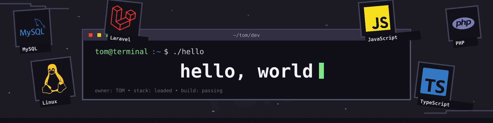

# Hi, I'm Tom 👋

  

I'm a **Full-Stack App Developer** with an M.Sc. in Information Technology.

- 💻 I build practical, scalable SaaS products that solve real-world problems.
- 🚀 My main stack is **Laravel, React, and MySQL**.
- 🧩 I care about clean code, maintainable architecture, and useful software.
- 📝 I share some of my development learnings through my [blog posts](https://dev.to/tommyc).

## Tech Stack 🚀

- **Backend:** PHP, Laravel
- **Frontend:** React, Tailwind CSS, Bootstrap
- **Data & Storage:** Redis, MySQL, PostgreSQL
- **Testing:** PHPUnit, Jest, Pest
- **Authentication & Security:** Laravel Sanctum, JWT, OAuth 2.0
- **Cloud & Deployment:** AWS, DigitalOcean, Docker

  

  

  

  

  

  

  

  

  

  

  

  

  

  

  

